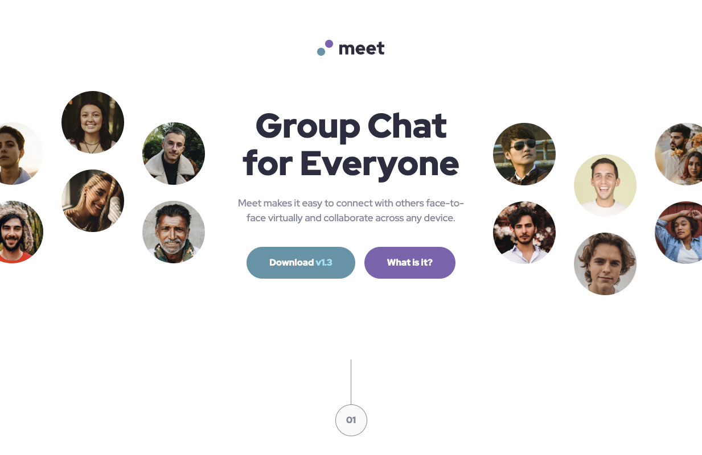

# Frontend Mentor - Meet landing page solution

This is a solution to the [Meet landing page challenge on Frontend Mentor](https://www.frontendmentor.io/challenges/meet-landing-page-rbTDS6OUR). Frontend Mentor challenges help you improve your coding skills by building realistic projects. 

## Table of contents

- [Overview](#overview)
  - [The challenge](#the-challenge)
  - [Screenshot](#screenshot)
  - [Links](#links)
- [My process](#my-process)
  - [Built with](#built-with)
  - [What I learned](#what-i-learned)
  - [Continued development](#continued-development)
  - [Useful resources](#useful-resources)
- [Author](#author)
- [Acknowledgments](#acknowledgments)

**Note: Delete this note and update the table of contents based on what sections you keep.**

## Overview

### The challenge

Users should be able to:## Table of contents

- [Overview](#overview)
  - [Screenshot](#screenshot)
  - [Links](#links)
- [My process](#my-process)
  - [Built with](#built-with)
- [Author](#author)

### Screenshot

<!--  -->

### Links

<!-- - Solution URL: [Add solution URL here](https://github.com/TomDoneix/four-card-feature-section) -->
<!-- - Live Site URL: [live site URL here](https://four-card-feature-section-three-sepia.vercel.app/) -->

## My process

### Built with

- Semantic HTML5 markup
- CSS custom properties
- Grid
- Tailwind
- Vite

## Author

- Frontend Mentor - [@tomdoneix](https://www.frontendmentor.io/profile/TomDoneix)